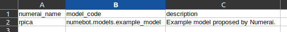
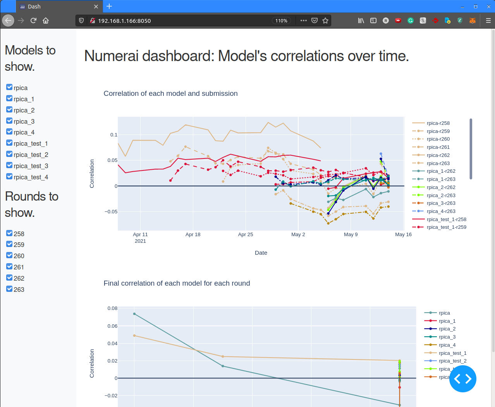

# Numebot: automation and monitoring for the Numerai tournament.

## Intro 

This repository was created with the intention of automating the weekly submission of predictions for the Numerai tournament [numer.ai](https://numer.ai). 

Numerai is a hedge fund running a weekly tournamente where data related to the performance of stocks in the stock market is released weekly, and predictions for the next 4 weeks are requiered. The data released is anonymized and obfuscated, and it is not possible to make use of it outside the tournament.

For details please refer to their [documentation](https://docs.numer.ai/tournament/learn) and [forums](https://forum.numer.ai/).

In to way this application or documentation is intended to be financial advise, and deciding to participate in the tournament staking any value is at your own risk.

### What the application does

At the moment this is a work in progress. So far, two features are implemented:

- Automated weekly run: the data is downloaded, the predictions generated with your models, and the predictions submitted for the tournament with a single command.

- A small dashboard with the daily and per-round performance of your models.

Some of the coming steps are described in [Future Work](#Future-work).

## How to install it

As usual, clone the repo:  
`git clone https://github.com/rpicatoste/numebot.git`  

It is advised to create an environment for this application, for example with Anaconda, and install the requirements:  
`conda create --name numebot`  
`pip install -r requirements.txt`

## How to use it

After cloning the project, several steps are required:

1. A folder where the weekly data, model files and submissions will be stored. Simply create the folder and set it in the `.env` file described below.

1. A csv describing the models and which code is running them.  
    

1. A `.env` file in the Numebot folder with the path to the data folder and the models csv. This file will be git-ignored. The content of this file should be:
    ```
    NUMERAI_DATA_FOLDER="/your/folder/"
    MODEL_CONFIGS_PATH="/your/model_configs.csv"
    ```

1. A `.secret` file in the Numebot folder with your Numerai credentials. These can be obtained in the website of Numerai. This file will be git-ignored. Example of the file:
    ```
    PUBLIC_ID=your_public_id
    SECRET_KEY=your_secret_key
    ```

1. Train your models.
    This part is not automated (yet), but it can be trained with the method `model.train_model(data)` as shown in the example notebook:
    `notebook/explore_models_and_data.ipynb`

1. To run the weekly submission, from the repo's folder and in the proper environment active:  
    `python api/run_it.py`  

1. To start the dashboard, from the same folder and environment:  
    `python -m numebot.monitoring.dashboard.dashboard_main`  
    And open the dashboard in the browser. If it's runining in your local host it will be: [http://localhost:8050](http://localhost:8050), else [your_host_ip:8050](your_host_ip:8050).

    


### Data folder structure

The data folder is automatically populated and looks as follows:

```
numerai_data                                    <- Root folder for the data
├── models                                      <- Folder related to models
│   ├── round_details.csv                       <- Round details are stored locally, here
│   └── name_1                                  <- Each model has a folder
│       ├── model_name_1.xgb                    <- File with the model weights
│       ├── name_1_leaderboard_info.csv         <- File with model leaderboard info
│       ├── name_1_submission_status_info.csv   <- File with model submission info
│       └── submissions                         <- Folder with the predictions generated 
│           └── name_1_submission_263.csv       <- Predictions for round 263
└── data                                        <- Folder for the weekly data.
    ├── numerai_dataset_263.zip                 <- zipped data for round 263 (one per round) 
    └── numerai_dataset_263                     <- Unzipped data (one per round)

```

### Model configs file

This file simply contains the name used in Numerai and the code for each model to run. 
It has been done this way as each model will be a project on its own, and having for example parameters to tune where would be cumbersome, as the parameters for one model might be a lot, and irrelevant for the other models.

The csv provided uses the code in `numebot.models.example_model`, which is the example provided by Numerai. 
This is a model that works already quite well, and improving it it's already an achievement.

What I have done is to create a parallel repo, `Numebot Private`, where I have the different attempts I do. In this way the central framework using each model's code to do the submission and building a dashboard can be shared.

## Future work

As stated at the beginning, this is a work in progress, and in addition it's a project done to help myself on the weekly participation and in the model training and monitoring for the Numerai tournament. 
As such, it has not been tested in different platforms or environments, and therefore it may fail in different ways.
Part of the future work will make it less prone to "In my machine works". 

The next big steps:

- Dockerize the pipeline so it can be deployed easily anywhere, including [Numerai compute](https://docs.numer.ai/tournament/compute).
- Improve the dashboard, a lot. Including allowing to take actions like generating submisions for individual models, check more metrics, etc.
- Provide better per-model tools and notebook for exploration and training. Each model can be a completely different world and its tuning is independent from the others.
